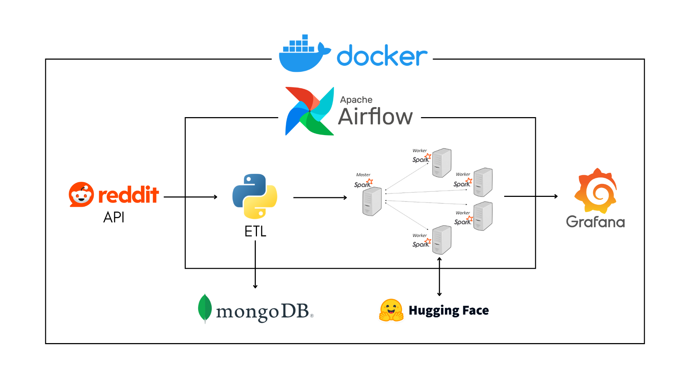
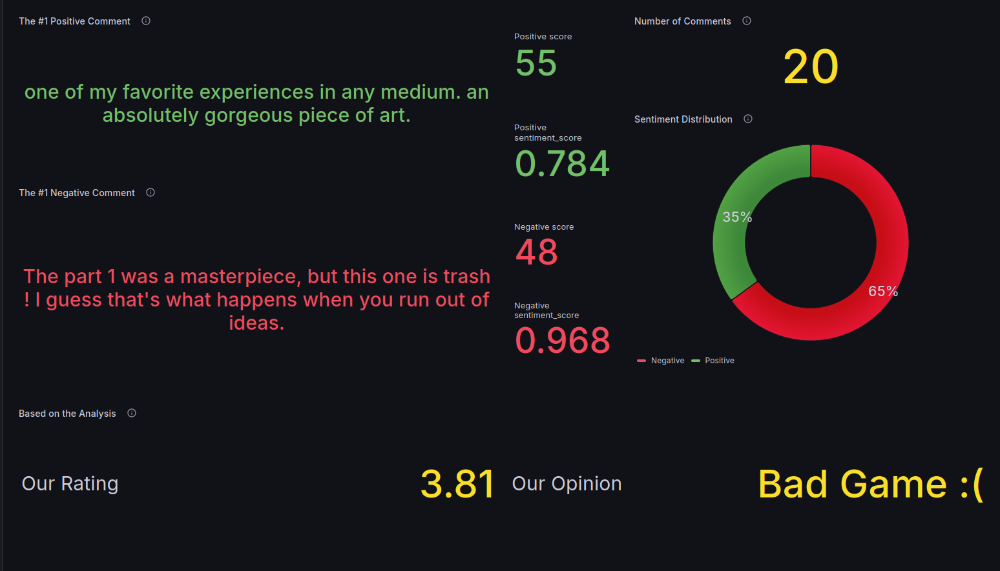

# Reddit Sentiment Analysis Pipeline

## Project Overview
This project is a comprehensive data pipeline designed to analyze public sentiment and opinions on a video game using Reddit data. It leverages the power of Spark for distributed data processing and Hugging Face's large language models (LLMs) for sentiment analysis. The results are visualized on a Grafana dashboard, providing insights into whether the sentiment is positive or negative and highlighting key opinions.



### Key Components:
1. **Reddit Data Extraction**: Extracts relevant posts and comments from Reddit.
2. **Data Cleaning & Processing**: Cleans and processes the data to remove unwanted characters, stopwords, and filters out irrelevant posts.
3. **Sentiment Analysis**: Applies Hugging Face's LLMs for sentiment analysis using a master-slave Spark architecture.
4. **Visualization**: Sentiment analysis results are visualized in real-time on a Grafana dashboard.

## Prerequisites

- Install **Docker** (preferably Docker Desktop).
- Ensure you have at least **16 GB of RAM** to efficiently run all the services (8 GB will cause performance issues).

## Getting Started

1. Clone the repository:
    ```bash
    git clone https://github.com/Bouguilim/Reddit-Pipeline.git
    cd Reddit-Pipeline
    ```

2. Modify the `congfig.conf` to add APIs token and the game name

3. Build and start the services with Docker Compose:
    ```bash
    docker-compose up -d --build
    ```

   This may take a few minutes as the images are built and services are initialized.

4. Once the containers have started, you can access the following services:

   - **Airflow UI**: Navigate to [http://localhost:8080](http://localhost:8080) to access Airflow.
     - Log in with the default credentials: 
       - Username: `admin`
       - Password: `admin`
     - Start the DAG to begin data processing.

   - **Grafana UI**: Navigate to [http://localhost:3000](http://localhost:3000) to access Grafana.
     - Log in with the default credentials:
       - Username: `admin`
       - Password: `admin`
     - Open the preconfigured dashboard to visualize the sentiment analysis results.

## Example: Sentiment Analysis on "The Last of Us Part 2"

Here’s a snapshot of a sentiment analysis dashboard for The Last of Us Part 2, a game that sparked significant debate in the gaming community.



Using the pipeline, we gathered Reddit discussions around the game, processed the data, and applied sentiment analysis to understand the overall public opinion. The dashboard provides a clear visual of how the community feels about different aspects of the game—highlighting both positive and negative sentiments, as well as key opinions.

You can easily apply the same pipeline to any video game or topic of interest and visualize the results in Grafana.